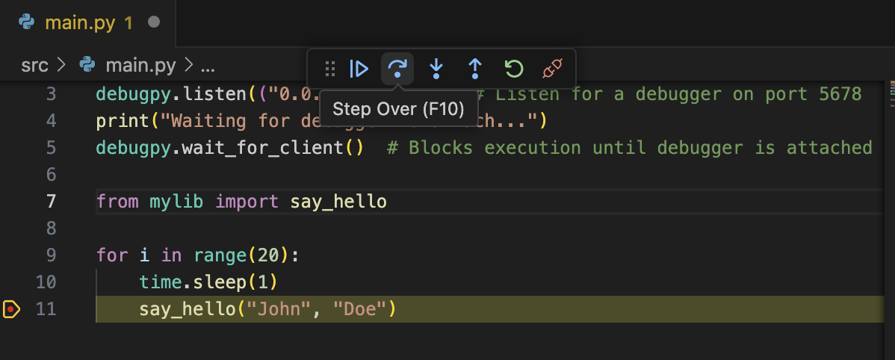

# Understanding debuggers in Python and VScode

## Conceptual understanding

### How do debuggers actually work in Python?

It seems that *all* debugging in Python relies on the python `sys.settrace()` method. This method allows you to set a callback function that is executed before *every* line executed by the Python interpreter (it is also called before a function is called, a function returns, or an exception occurs). See [here](https://www.geeksforgeeks.org/python-sys-settrace/) for more details.

Try reading, running and understanding `src/traceexample.py` to investigate how this function works.

### How do we connect `sys.settrace` to debug tooling?

There are some simple actions we usually wish to have when debugging code. This include things like breakpoints, variable inspection and manual step-through.



A debugger is a tool that uses `sys.settrace()` to allow such interactions. We can imagine simple implementations of this: for example, storing breakpoints (i.e. file + line) and checking each call to the trace callback function to see if they match.

In a typical implementation, we will interact with this debugger by having it set up a server that we can talk to. A standard protocol for this server interface (at least, in VScode) is defined in the [debug adapter protocol](https://microsoft.github.io/debug-adapter-protocol//).

### How to set up `debugpy` for VScode

See [`src/main.py'](/src/main.py) for an example of how we might set up a debugging server within our code, using the `debugpy` library. In the example provided, the debug server is set to listen on port 5678.

The next step is to connect to the server using 

## Running this example

To demonstrate remote debugging, the example is implemented using a Docker container. Note: You must have [Docker](https://www.docker.com/) installed and running on your local machine. You can then run:

```shell
docker build -t learningdebugpy .
docker run -p 5678:5678 -it learningdebugpy
```

Followed by going to "Run and Debug" in VScode and then running the "Python Debugger: Remote Attach". This will connect the VScode debugger to the Python file you're running! You can set breakpoints in `src/main.py` (or `src/mylib/__init__.py`, which it calls), step over function calls, etc.